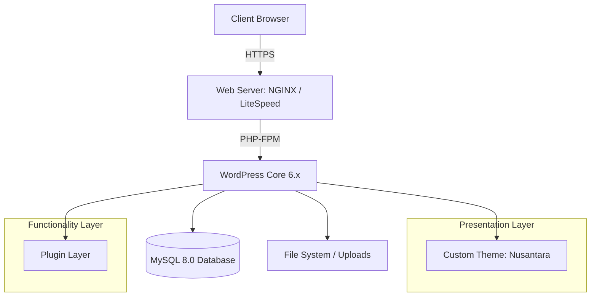

# Project Architecture: PT Nusantara Digital

## Overall Architecture
The PT Nusantara Digital website is built on a monolithic WordPress architecture, heavily optimized for performance and security. It separates concerns between content management (Core/Database), presentation (Theme), and extended functionality (Plugins).

## Frontend Layer
- **Responsibility:** Handles what the user sees and interacts with.
- **Tech Stack:** HTML5, CSS3 (using BEM methodology), Vanilla JavaScript (ES6+).
- **Execution:** Delivered by the WordPress Theme layer, structured for fast Time to First Byte (TTFB) and optimized Core Web Vitals.

## WordPress Layer
- **Responsibility:** Acts as the CMS (Content Management System) and core routing engine.
- **Components:** WordPress Core (kept strictly unmodified), Admin Dashboard, User Management, and the REST API.

## Plugin Layer
- **Responsibility:** Injects specific functionality that is independent of the visual design.
- **Components:** Elementor (Page Builder), Contact Form 7 / WPForms (Lead generation), Yoast SEO (Metadata), LiteSpeed Cache (Performance).
- **Rule:** Plugins are kept to an absolute minimum to reduce security vulnerabilities and database bloat.

## Theme Layer
- **Responsibility:** Dictates the visual presentation and layout of the data.
- **Implementation:** A custom-built WordPress theme specifically tailored for PT Nusantara Digital, ensuring zero bloat compared to commercial multi-purpose themes.

## Database Layer
- **Responsibility:** Stores all relational data.
- **Tech Stack:** MySQL 8.0.
- **Data:** Posts, Pages, Custom Post Types (e.g., Portfolio, Careers), User Data, and Options (Site settings).

## Media Layer
- **Responsibility:** Stores and serves static assets.
- **Tech Stack:** Local File System (`wp-content/uploads/`) with future-proofing for CDN integration.
- **Optimization:** WebP image generation and lazy-loading implemented via LiteSpeed Cache.

## Deployment Layer
- **Responsibility:** Moves code from LocalWP to the staging/production server.
- **Tech Stack:** GitHub for version control, automated or manual sync (FTP/SSH) to the production server.
